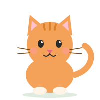
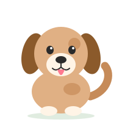

 

&nbsp;&nbsp;&nbsp;

My two favourite code reviewers. Zero bugs found, unlimited cuddles.

## 🌱 My Story So Far

Every project I've built started with one small question: *"Would someone actually use this?"*

I love building things that leave my laptop and land in real people's hands. That's why I'm drawn to **Android development**, where an idea becomes an app in someone's pocket, and to **AI/ML**, where a model can learn to help people in ways that once felt impossible.

Between builds, I solve **DSA problems**, because I love finding patterns. A tangled problem slowly reveals its shape, and suddenly it makes sense. That feeling never gets old.

Right now I'm growing one commit at a time, with a bigger dream behind it: to build real-world products and to **explore the world** beyond the screen, one new place and one new idea at a time. 🌍

## 🌿 Languages I Speak

## 🌳 Things I've Grown

| Project | What it does | Built with |
|---|---|---|
| **🩺 MediLingua** | Bilingual (English–Gujarati) question answering over medicine leaflets, making drug information accessible to more people | Python, NLP, ML |
| **📍 DocFinder** | Android app that helps people find nearby doctors quickly | Kotlin, Firebase, Google Maps |
| **🛡️ InternShield** | AI-powered detector that flags fake internship offers as Safe, Suspicious, or High Risk, with explanations | Python, ML |
| **⚛️ PhysiSVG Labs** | Interactive SVG-based physics simulations for virtual labs at VLab SAKEC | JavaScript, SVG, React |
| **📊 Pulse Insights** | Social media analytics dashboards that turn raw engagement data into stories | Power BI, Tableau |

> Replace the project names with your own repo links, for example `[**MediLingua**](https://github.com/YOUR_USERNAME/medilingua)`.

### 🌸 A Thought I Carry With Me

*"The entire point of life is to take a chance on dreams that seem crazy to most but feel like destiny to you."*

 

 

